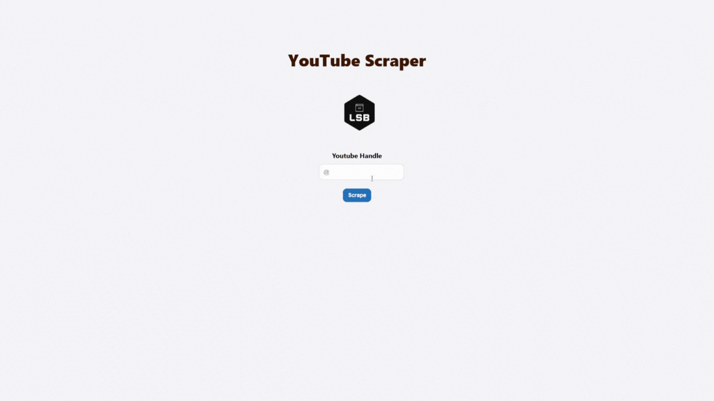

# **`Youtube Scraping Project`**



- ## **Description**
  > ### The YouTube Scraper project is a versatile and powerful tool designed to extract valuable data and insights from YouTube, one of the world's largest video-sharing platforms. This project aims to automate the process of scraping data from YouTube using selenium and beautifulsoup and scrape details like video title, views, upload time, video link, thumbnail link, etc... and finally dump them to MongoDB.

> ## Try it out at [Youtube Scraper](https://youtube-scraper-a0ve.onrender.com)

- ## **Applications Used**

  1. [Python3](https://www.python.org/)
  2. [Anaconda](https://www.anaconda.com/)
  3. [VSCodeIDE](https://code.visualstudio.com/)
  4. [MongoDB](https://www.mongodb.com/)
  5. [GitCLI](https://git-scm.com/book/en/v2/Getting-Started-The-Command-Line)
  6. [Github](https://github.com)
  7. [Render](https://render.com/)
  8. [Flask](https://flask.palletsprojects.com/en/2.4.x/)
  9. [Waitress](https://docs.pylonsproject.org/projects/waitress/en/stable/)

- ## **How to use?**

  > ### 1. Clone the repository
  >
  > ```bash
  > git clone https://github.com/CodeWithCosmo/youtube-scraper.git
  > ```

  > ### 2. Install the dependencies
  >
  > ```bash
  > pip install -r requirements.txt
  > ```

  > ### 3. Run the application
  >
  > ```bash
  > python app.py
  > ```

  > ### 4. Access the application
  >
  > ```bash
  > http://localhost:8080
  > ```

- ## **Author**

  > ### [CodeWithCosmo](https://github.com/CodeWithCosmo)

- ## **License**
  > ### This project is licensed under the MIT License - see the [LICENSE](LICENSE) file for details.
